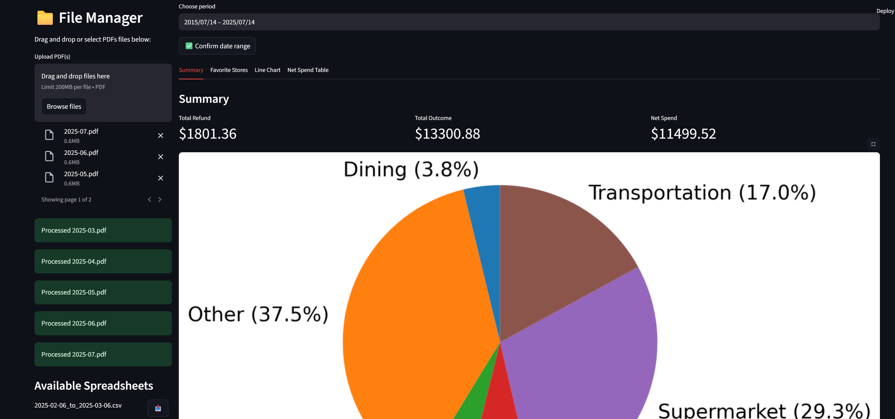

# Bank Statement Analyzer

A Streamlit web application that automatically extracts, analyzes, and visualizes your spending from PDF bank statements.
---
 

## Features
- Extracts date, merchant, and amount from PDF bank statements. (Verified RBC, Rogers, and CIBC)
- Filter transactions and reports by any time period you choose.
- Download all extracted and categorized transactions as a CSV file.
### Multiple Views
- **Summary**: See total income, expenses, and a pie chart by category.
- **Favorite Stores**: View your most-visited merchants ranked by spend or frequency.
- **Trend Analysis**: Track your spending over time with a line chart.
- **Net Spend Table**: Compare net spending by category across different time periods.

---
## How to Run

1.  **Clone the repository:**
    ```bash
    cd Bank_Statement_Analyzer 
    ```

2.  **Install dependencies:**
    ```bash
    pip install -r requirement.txt
    ```

3.  **Run the Streamlit app:**
    ```bash
    streamlit run main.py
    ```

4.  Open your browser to the URL provided by Streamlit (usually `http://localhost:8501`).

## Customization

You can customize the merchant name mapping and spending categories by editing the following files:

-   `merchant_map.json`: Use this to group different merchant names under a single, standard name. For example, map `"Walmart Store #123"` and `"WALMART.COM"` to `"Walmart"`.
    ```json
    {
      "Walmart Store #123": "Walmart",
      "WALMART.COM": "Walmart"
    }
    ```

-   `category.json`: Define your spending categories and the keywords (standardized merchant names) that belong to them.
    ```json
    {
      "Groceries": ["Walmart", "SUPERSTORE", "SAFEWAY"],
      "Entertainment": ["Netflix", "Spotify"],
      "Restaurants": ["STARBUCKS"]
    }
    ``` 


## Upcoming
- User friendly ways to modify Category.
